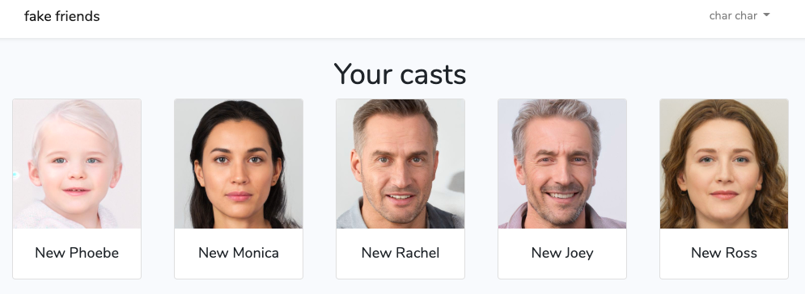
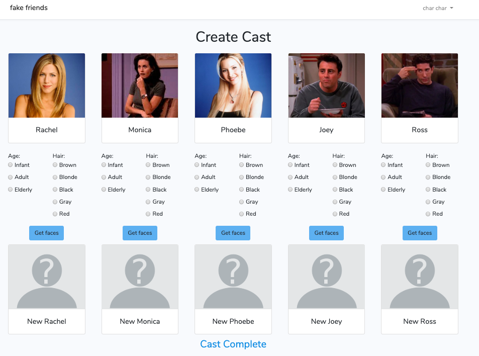

# fake friends
A simple web application that allows you to recast the hit tv show friends with ai generated faces. Built with Laravel and VueJs.



# Getting Started

### Prerequisites

* [Composer](https://getcomposer.org/download/)

### Installation

1. Clone the repository

```
git clone git@github.com:charcharmasonjar/fake-friends.git
```

2. Change to project directory

```
cd fake-friends
```

3. Install Composer dependencies

````
composer install
````

4. Install Node modules

````
npm install
````

or 

```
yarn
```

5. Create .env file by copying the .env.example file

```
cp .env.example .env
```

6. Create empty database for the application. 

7. Modify `DB_*` value in `.env` with your database config.

```
DB_CONNECTION=mysql
DB_HOST=
DB_PORT=
DB_DATABASE=
DB_USERNAME=
DB_PASSWORD=
```

8. Migrate the database

````
php artisan migrate
````

9. Optional: seed the database

````
php artisan db:seed
````

This command will create some users, casts, and casts members in the database, but is not required for the app to run.

10. Get api key for the Generated Photos api and add to .env file.
    * go to https://generated.photos/api and create an account
    * from your account dashboard, go to API Dashboard > Your API key
    * update the `GENERATED_PHOTOS_KEY=` value in the .env file

11. Serve Laravel

````
php artisan serve
````

12. Open another terminal window, and run

```
npm run watch
```

13. Go to http://localhost:8000 to view the app in the browser.



### Project ERD

